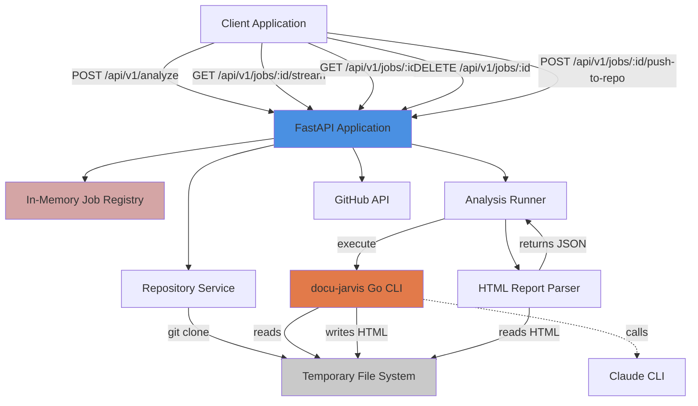
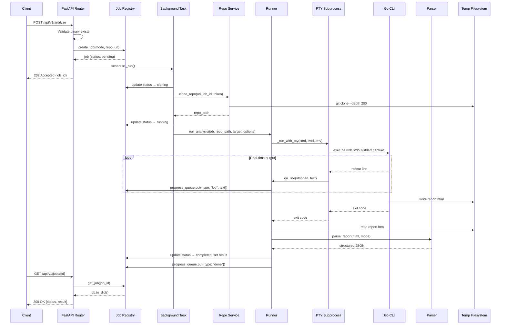

# Docu-Jarvis Backend Architecture

## Table of Contents

1. [Overview](#overview)
2. [Repo Use Cases](#repo-use-cases)
3. [High-Level Architecture](#high-level-architecture)
4. [Core Components](#core-components)
5. [Data Flow](#data-flow)
6. [Code Implementation](#code-implementation)
7. [Integration Points](#integration-points)
8. [Configuration](#configuration)
9. [Monitoring and Operations](#monitoring-and-operations)

## Overview

Docu-Jarvis Backend is a FastAPI-based REST API that serves as an asynchronous wrapper around a Go-based CLI binary (`docu-jarvis`). The system provides AI-powered code analysis capabilities for Go repositories, delivering security scanning, impact analysis, historical archaeology, debugging assistance, and commit explanation features. The backend handles repository cloning, job orchestration, real-time progress streaming via Server-Sent Events (SSE), HTML report parsing, and optional GitHub Pull Request creation for analysis results.

The backend sits between client applications (typically web frontends) and the Go CLI binary, providing asynchronous job management, progress monitoring, and structured JSON responses parsed from the CLI's HTML output.

Key characteristics:

- **Asynchronous job execution**: Analysis requests return immediately with a job ID; processing occurs in background tasks
- **Real-time progress streaming**: Server-Sent Events deliver live progress updates from the running CLI binary
- **Multi-mode analysis**: Supports security, impact, why, debug, explain, update-docs, and write-docs analysis modes
- **Repository isolation**: Each job clones repositories into isolated temporary directories
- **HTML report parsing**: Extracts structured data from HTML reports generated by the Go binary

## Repo Use Cases

### 1. Analyse Repository Security Vulnerabilities

**Trigger**: `POST /api/v1/analyze` with `mode: security`

**Outcome**: OWASP Top 10 security scan with Abstract Syntax Tree (AST) and data-flow analysis, returned as structured JSON containing findings with severity levels, file locations, code snippets, explanations, and remediation guidance.

**Components Involved**: `analysis.py:start_analysis()`, `repo_service.py:clone_repo()`, `runner.py:run_analysis()`, `parser.py:_parse_security()`

**Constraints**: Requires valid `docu-jarvis` binary path, valid repository URL, and Claude CLI authentication in the environment where the Go binary runs.

### 2. Assess Change Impact with Call Graph Analysis

**Trigger**: `POST /api/v1/analyze` with `mode: impact` and `options.target` specifying a function or file path

**Outcome**: Risk assessment (0–100 score) showing blast radius via breadth-first search call graph traversal, including direct/indirect callers, affected packages, critical call paths, and recommended testing strategy.

**Components Involved**: `analysis.py:start_analysis()`, `runner.py:run_analysis()`, `parser.py:_parse_impact()`

**Constraints**: Analysis quality depends on Go code structure and call graph completeness; timeout set to 600 seconds by default.

### 3. Stream Real-Time Analysis Progress

**Trigger**: `GET /api/v1/jobs/{id}/stream` immediately after submitting an analysis job

**Outcome**: Server-Sent Events stream delivering log lines, status updates, and completion notifications in real time as the Go binary executes.

**Components Involved**: `analysis.py:stream_job_progress()`, `runner.py:_run_with_pty()`, in-memory job registry

**Constraints**: Relies on pseudo-TTY (PTY) for capturing real-time output on Unix systems; falls back to buffered output on Windows.

### 4. Push Analysis Report to GitHub via Pull Request

**Trigger**: `POST /api/v1/jobs/{job_id}/push-to-repo` with a GitHub personal access token and markdown content

**Outcome**: Creates a new branch, commits the report to a designated path (e.g., `docs/security-report.md`), pushes to GitHub, and opens a Pull Request with metadata about the analysis.

**Components Involved**: `analysis.py:push_report_to_repo()`, GitPython library, GitHub REST API

**Constraints**: Requires completed job with available repository clone, valid GitHub token with push and PR creation permissions, and parseable GitHub repository URL.

### 5. Retrieve Completed Job Results

**Trigger**: `GET /api/v1/jobs/{id}` for polling job status

**Outcome**: JSON response containing job status (`pending`, `cloning`, `running`, `completed`, `failed`), parsed result data, and any error messages.

**Components Involved**: `analysis.py:get_job_status()`, `runner.py:get_job()`, in-memory job registry

**Constraints**: Jobs exist only in memory for the lifetime of the server process; no persistence across restarts.

### 6. Clean Up Temporary Job Files

**Trigger**: `DELETE /api/v1/jobs/{id}`

**Outcome**: Removes cloned repository and generated reports from the temporary directory.

**Components Involved**: `analysis.py:delete_job()`, `repo_service.py:cleanup_job()`

**Constraints**: Cleanup is manual; no automatic garbage collection is implemented in the provided codebase.

## High-Level Architecture



**Architectural Decisions:**

- **In-memory job registry**: Jobs are stored in a module-level dictionary (`_jobs` in `runner.py:26`) rather than a database. This design assumes single-process deployment and ephemeral job lifetimes. The comment at `runner.py:26` explicitly notes "swap for Redis in production".

- **Subprocess execution with PTY**: The system uses pseudo-terminals (`pty` module in `runner.py:154`) to capture real-time output from the Go binary, enabling proper rendering of terminal UI elements (progress spinners, ANSI colours). A Windows fallback exists at `runner.py:209`.

- **Asynchronous background tasks**: FastAPI's `BackgroundTasks` mechanism (`analysis.py:68`) decouples request handling from long-running analysis execution, enabling immediate response with job ID.

- **HTML report parsing**: The Go binary outputs HTML reports; the backend parses these with BeautifulSoup (`parser.py:290`) to extract structured JSON for API consumers.

## Core Components

### 1. FastAPI Application (`app/main.py`)

**Purpose**: Application entry point, middleware configuration, and router registration.

**Responsibilities**:
- Initialises FastAPI with metadata (title, description, version) at `main.py:25`
- Configures CORS middleware with origins from settings at `main.py:32`
- Registers analysis and health routers at `main.py:40-41`
- Provides lifespan management for startup/shutdown logging at `main.py:16`

**Key Files**: `app/main.py`

### 2. Configuration Management (`app/core/config.py`)

**Purpose**: Centralised settings using Pydantic Settings with environment variable support.

**Responsibilities**:
- Loads configuration from `.env` file via `pydantic_settings.BaseSettings` at `config.py:10`
- Defines `docu_jarvis_binary` path with a default relative to the codebase at `config.py:21-25`
- Specifies `temp_dir` for cloned repositories and reports (default `/tmp/docu-jarvis`) at `config.py:28`
- Provides `cors_origins` list and `job_timeout` (600 seconds) at `config.py:31-34`
- Creates temporary directory on module load at `config.py:40`

**Key Files**: `app/core/config.py`

### 3. Custom Exceptions (`app/core/exceptions.py`)

**Purpose**: Domain-specific HTTP exceptions for consistent error handling.

**Responsibilities**:
- `BinaryNotFoundError`: 503 error when Go binary is missing (`exceptions.py:4`)
- `RepoCloneError`: 422 error for Git clone failures (`exceptions.py:13`)
- `JobNotFoundError`: 404 error for invalid job IDs (`exceptions.py:21`)
- `AnalysisError`: Generic exception for analysis process errors (`exceptions.py:26`)

**Key Files**: `app/core/exceptions.py`

### 4. Request and Response Models (`app/models/`)

**Purpose**: Pydantic models for request validation and response serialisation.

**Responsibilities**:
- `AnalysisMode` enum defining supported modes (`requests.py:9-16`)
- `AnalysisRequest` with URL validation ensuring GitHub/GitLab URLs only (`requests.py:49-55`)
- `JobStatus` enum tracking job lifecycle states (`responses.py:9-14`)
- Mode-specific result models: `SecurityResult`, `ImpactResult`, `WhyResult`, `RawTextResult` (`responses.py:19-95`)
- `JobResponse` and `ProgressEvent` for API responses (`responses.py:99-111`)

**Key Files**: `app/models/requests.py`, `app/models/responses.py`

### 5. Analysis Router (`app/routers/analysis.py`)

**Purpose**: RESTful endpoints for job submission, status polling, streaming, cleanup, and GitHub integration.

**Responsibilities**:
- `POST /api/v1/analyze`: Validates binary existence, creates job, schedules background task (`analysis.py:32`)
- `GET /api/v1/jobs/{job_id}`: Returns current job status and results (`analysis.py:72`)
- `GET /api/v1/jobs/{job_id}/stream`: SSE endpoint with keep-alive pings every 30 seconds (`analysis.py:80`)
- `DELETE /api/v1/jobs/{job_id}`: Triggers cleanup of temporary files (`analysis.py:113`)
- `POST /api/v1/jobs/{job_id}/push-to-repo`: Pushes markdown report to GitHub and creates PR (`analysis.py:131`)

**Key Files**: `app/routers/analysis.py`

### 6. Health Router (`app/routers/health.py`)

**Purpose**: Simple health check endpoint.

**Responsibilities**:
- `GET /health`: Returns binary existence status and path (`health.py:10`)

**Key Files**: `app/routers/health.py`

### 7. Repository Service (`app/services/repo_service.py`)

**Purpose**: Git repository cloning and cleanup operations.

**Responsibilities**:
- `clone_repo()`: Clones repositories with optional GitHub token injection for private repos (`repo_service.py:16`)
- Uses shallow clone with 200-commit depth and single branch (`repo_service.py:40`)
- `cleanup_job()`: Recursively removes job directory (`repo_service.py:49`)

**Key Files**: `app/services/repo_service.py`

### 8. Analysis Runner (`app/services/runner.py`)

**Purpose**: Job orchestration, subprocess management, and real-time output streaming.

**Responsibilities**:
- Maintains in-memory job registry (`_jobs` dictionary at `runner.py:26`)
- `create_job()`: Generates UUID-based job IDs (`runner.py:98`)
- `_build_cmd()`: Constructs CLI command arguments based on mode and options (`runner.py:109`)
- `_run_with_pty()`: Executes Go binary in pseudo-terminal, captures output line-by-line (`runner.py:146`)
- `_make_spinner_filter()`: Deduplicates spinner frames and detects Claude spending cap errors (`runner.py:33`)
- `run_analysis()`: Async wrapper coordinating cloning, execution, parsing, and progress streaming (`runner.py:226`)

**Key Files**: `app/services/runner.py`

### 9. HTML Report Parser (`app/services/parser.py`)

**Purpose**: Extracts structured data from HTML reports generated by the Go binary.

**Responsibilities**:
- `_parse_security()`: Parses OWASP findings with severity, file location, snippets, and AI-generated explanations (`parser.py:86`)
- `_parse_impact()`: Extracts risk scores, call graph metrics, and impact narratives (`parser.py:195`)
- `_parse_why()`: Parses classification, confidence scores, and historical evidence summaries (`parser.py:249`)
- Helper functions: `_kv_map()` for key-value stats, `_section_map()` for narrative sections (`parser.py:28-50`)

**Key Files**: `app/services/parser.py`

## Data Flow

### End-to-End Analysis Request Flow

The following sequence diagram illustrates a complete analysis request from submission to result retrieval:



### Key Data Transformations

1. **Request Validation** (`analysis.py:33-36`): `AnalysisRequest` model validates repository URL format, ensuring only GitHub/GitLab URLs are accepted.

2. **Command Construction** (`runner.py:109-143`): Analysis options are transformed into CLI arguments. For example, security mode becomes `[binary, "-security", target, "-report", report_path]`.

3. **Output Streaming** (`runner.py:170-192`): Raw PTY output undergoes ANSI stripping, line splitting on `\r` or `\n`, and spinner frame deduplication before being queued as progress events.

4. **HTML to JSON Parsing** (`parser.py:86-300`): BeautifulSoup extracts key-value pairs (`.kv` elements), narrative sections (`.section .body`), and finding blocks (`.finding`) to construct typed Pydantic models.

5. **Environment Variables** (`runner.py:250-253`): Job context is passed to the Go binary via environment: `REPO_URL`, `GITHUB_TOKEN`, and `TERM=xterm-256color` for terminal rendering.

### State Transitions

Job status transitions follow this sequence:

```
pending → cloning → running → completed
                           ↘ failed
```

- **pending**: Job created but not yet started (`runner.py:80`)
- **cloning**: Repository clone in progress (`analysis.py:39`)
- **running**: Go binary executing (`runner.py:263`)
- **completed**: Analysis finished successfully, result parsed (`runner.py:311`)
- **failed**: Error during clone, execution, or timeout (`runner.py:64`, `runner.py:290`, `runner.py:321`)

## Code Implementation

This section traces complete execution flows from API entry points through to results.

### Flow 1: Submitting a Security Analysis Job

**Entry Point**: `POST /api/v1/analyze` with `{"repo_url": "https://github.com/user/repo", "mode": "security"}`

#### Step 1: Request Handling and Validation

**File: `app/routers/analysis.py`**
```python
@router.post("/analyze", response_model=JobResponse, status_code=202)
async def start_analysis(body: AnalysisRequest, background_tasks: BackgroundTasks):
    # Validate binary exists
    if not Path(settings.docu_jarvis_binary).exists():
        raise BinaryNotFoundError(settings.docu_jarvis_binary)

    job = create_job(body.mode.value, body.repo_url)
    job.status = JobStatus.cloning
```

**Explanation**: The endpoint validates the Go binary exists at the configured path. If missing, a 503 error is raised. The `AnalysisRequest` Pydantic model (defined in `requests.py:40`) automatically validates the URL format via the `validate_repo_url` field validator at `requests.py:49`, ensuring only GitHub/GitLab URLs are accepted. A new job is created with a UUID identifier via `create_job()`.

#### Step 2: Job Creation and Registry Storage

**File: `app/services/runner.py`**
```python
def create_job(mode: str, repo_url: str) -> AnalysisJob:
    job_id = str(uuid4())
    job = AnalysisJob(job_id, mode, repo_url)
    _jobs[job_id] = job
    return job
```

**Explanation**: A UUID is generated for the job, and an `AnalysisJob` instance is created with `status = JobStatus.pending` (set in `__init__` at `runner.py:80`). The job is stored in the module-level `_jobs` dictionary at `runner.py:26` for later retrieval. The `AnalysisJob` class includes an asyncio queue (`progress_queue`) for real-time progress events.

#### Step 3: Background Task Scheduling

**File: `app/routers/analysis.py`**
```python
    async def _run():
        try:
            await job.progress_queue.put({"type": "status", "text": "Cloning repository…"})
            # Clone in thread pool to not block the event loop
            loop = asyncio.get_running_loop()
            repo_path = await loop.run_in_executor(
                None, clone_repo, body.repo_url, job.job_id, body.github_token
            )
            await job.progress_queue.put(
                {"type": "status", "text": "Repository cloned. Starting analysis…"}
            )
            opts = body.options.model_dump()
            if body.github_token:
                opts["github_token"] = body.github_token
            await run_analysis(
                job=job,
                repo_path=repo_path,
                target=body.options.target,
                api_key="",
                options=opts,
            )
        except Exception as exc:
            logger.exception("Job %s failed", job.job_id)
            job.status = JobStatus.failed
            job.error = str(exc)
            await job.progress_queue.put({"type": "done", "status": "failed"})

    background_tasks.add_task(_run)
    return job.to_dict()
```

**Explanation**: The `_run()` coroutine is scheduled as a background task via FastAPI's `BackgroundTasks` at `analysis.py:68`. This allows the endpoint to return immediately with a 202 status and the job ID. The coroutine first enqueues a progress event, then clones the repository in a thread pool executor (since `git.Repo.clone_from` is blocking I/O). If cloning succeeds, it proceeds to `run_analysis()`. Any exceptions are caught and reflected in the job's error state.

#### Step 4: Repository Cloning

**File: `app/services/repo_service.py`**
```python
def clone_repo(repo_url: str, job_id: str, github_token: str | None = None) -> str:
    dest = Path(settings.temp_dir) / job_id / "repo"
    dest.mkdir(parents=True, exist_ok=True)

    # Inject token into HTTPS URL: https://TOKEN@github.com/...
    clone_url = repo_url
    if github_token:
        from urllib.parse import urlparse, urlunparse
        parsed = urlparse(repo_url)
        if parsed.scheme in ("http", "https"):
            authed = parsed._replace(netloc=f"{github_token}@{parsed.hostname}")
            clone_url = urlunparse(authed)

    try:
        logger.info("Cloning %s → %s", repo_url, dest)
        git.Repo.clone_from(
            clone_url,
            str(dest),
            depth=200,  # sufficient for history-based analyses
            single_branch=True,
        )
        return str(dest)
    except git.GitCommandError as exc:
        shutil.rmtree(str(dest.parent), ignore_errors=True)
        raise RepoCloneError(repo_url, str(exc)) from exc
```

**Explanation**: The repository is cloned into a job-specific directory (`/tmp/docu-jarvis/{job_id}/repo`). If a GitHub token is provided, it is injected into the URL to enable access to private repositories. The clone is shallow (200 commits) and single-branch to reduce time and disk usage. If cloning fails, the temporary directory is cleaned up and a `RepoCloneError` (422 status) is raised.

#### Step 5: Analysis Execution

**File: `app/services/runner.py`**
```python
async def run_analysis(
    job: AnalysisJob,
    repo_path: str,
    target: str,
    api_key: str,
    options: dict,
) -> None:
    from app.services.parser import parse_report

    loop = asyncio.get_running_loop()

    # Set up report output path
    report_path = str(Path(settings.temp_dir) / job.job_id / "report.html")
    Path(report_path).parent.mkdir(parents=True, exist_ok=True)
    job.report_path = report_path

    env = {**os.environ, "REPO_URL": job.repo_url, "TERM": "xterm-256color"}
    if options.get("github_token"):
        env["GITHUB_TOKEN"] = options["github_token"]

    try:
        cmd = _build_cmd(job.mode, target, report_path, options)
    except AnalysisError as exc:
        job.status = JobStatus.failed
        job.error = str(exc)
        await job.progress_queue.put({"type": "done", "status": "failed"})
        return

    job.status = JobStatus.running
    await job.progress_queue.put(
        {"type": "status", "text": f"Running {job.mode} analysis…"}
    )

    def _send(line: str) -> None:
        loop.call_soon_threadsafe(
            job.progress_queue.put_nowait, {"type": "log", "text": line}
        )

    output_lines: list[str] = []

    def _run() -> int:
        def on_line(line: str) -> None:
            output_lines.append(line)
            _send(line)
        return _run_with_pty(cmd, repo_path, env, on_line)

    try:
        rc = await asyncio.wait_for(
            loop.run_in_executor(None, _run),
            timeout=settings.job_timeout,
        )
    except asyncio.TimeoutError:
        job.status = JobStatus.failed
        job.error = "Analysis timed out"
        await job.progress_queue.put({"type": "done", "status": "failed"})
        return
```

**Explanation**: The report output path is constructed within the job's directory. Environment variables are prepared, including `REPO_URL` and `TERM` for terminal rendering. The command is built via `_build_cmd()`, which for security mode produces `[binary, "-security", target, "-report", report_path]`. The job status is updated to `running`, and a progress event is enqueued. The `_run()` function is executed in a thread pool with a timeout of 600 seconds (configurable via `settings.job_timeout`). Each output line from the PTY is sent to the progress queue in real time via `call_soon_threadsafe` to ensure thread safety.

#### Step 6: Subprocess Execution with PTY

**File: `app/services/runner.py`**
```python
def _run_with_pty(cmd: list[str], cwd: str, env: dict, on_line) -> int:
    on_line = _make_spinner_filter(on_line)
    try:
        import pty

        master_fd, slave_fd = pty.openpty()

        proc = subprocess.Popen(
            cmd,
            stdin=slave_fd,
            stdout=slave_fd,
            stderr=slave_fd,
            cwd=cwd,
            env=env,
        )
        os.close(slave_fd)

        buf = b""

        while True:
            try:
                readable, _, _ = select.select([master_fd], [], [], 0.2)
                if readable:
                    try:
                        chunk = os.read(master_fd, 4096)
                    except OSError:
                        break
                    if not chunk:
                        break
                    buf += chunk
                    text = buf.decode("utf-8", errors="replace")
                    clean = strip_ansi(text)
                    parts = re.split(r"\r|\n", clean)
                    for part in parts[:-1]:
                        stripped = part.strip()
                        if stripped:
                            on_line(stripped)
                    buf = parts[-1].encode("utf-8")
                else:
                    if proc.poll() is not None:
                        remaining = strip_ansi(buf.decode("utf-8", errors="replace")).strip()
                        if remaining:
                            on_line(remaining)
                        break
            except OSError:
                break

        try:
            os.close(master_fd)
        except OSError:
            pass

        return proc.wait()
```

**Explanation**: A pseudo-terminal is created to capture the Go binary's output with terminal control sequences intact. The process is spawned with stdin, stdout, and stderr connected to the PTY slave. The master file descriptor is polled in 200ms intervals using `select.select()`. Incoming data is buffered, decoded to UTF-8, and stripped of ANSI escape codes via the `strip_ansi()` regex at `runner.py:29`. Lines are split on carriage return or newline (to handle progress bars with `\r`), and non-empty lines are passed to the `on_line` callback after being filtered by `_make_spinner_filter()` to deduplicate spinner frames and detect Claude spending cap errors. The process exit code is returned after cleanup.

#### Step 7: Spinner Frame Deduplication and Error Detection

**File: `app/services/runner.py`**
```python
def _make_spinner_filter(on_line):
    _last: list = [None]
    _cap_seen: list = [False]

    def filtered(line: str) -> None:
        lower = line.lower()

        if "spending cap" in lower or "spending cap reached" in lower:
            _cap_seen[0] = True
            on_line("✗ Claude usage limit reached — your spending cap has been hit. "
                    "Visit https://claude.ai to increase your limit or wait for it to reset.")
            return

        if "cli process error (exit code 1)" in lower or "failed to read stderr" in lower:
            if _cap_seen[0]:
                on_line("✗ Analysis failed due to Claude spending cap (see above)")
            else:
                on_line("✗ Claude CLI error (exit code 1) — check that 'claude' is "
                        "authenticated and your usage limit has not been reached")
            return

        if line and line[0] in _SPINNER_CHARS:
            content = line[1:].strip()
            if content == _last[0]:
                return  # duplicate frame — suppress
            _last[0] = content
            on_line(content or line)
        else:
            _last[0] = None
            on_line(line)

    return filtered
```

**Explanation**: The filter maintains closure state to track the last spinner content and whether a spending cap error has been seen. Bubbletea/Charmbracelet spinners emit identical lines with only the leading spinner character changing; these are collapsed by checking if the content after the first character matches the previous line. If a spending cap error is detected (via keywords in the output), a user-friendly message is emitted, and subsequent CLI error messages are enriched with context.

#### Step 8: HTML Report Parsing

**File: `app/services/runner.py`**
```python
    html_path = Path(report_path)
    if html_path.exists():
        try:
            result = parse_report(html_path.read_text(encoding="utf-8"), job.mode)
            job.result = result
            job.status = JobStatus.completed
        except Exception as exc:
            logger.warning("HTML parse failed, falling back to raw output: %s", exc)
            job.result = {"output": "\n".join(output_lines)}
            job.status = JobStatus.completed
    elif output_lines:
        job.result = {"output": "\n".join(output_lines)}
        job.status = JobStatus.completed
    else:
        job.status = JobStatus.failed
        job.error = f"Analysis produced no output (exit code {rc})"

    await job.progress_queue.put({"type": "done", "status": job.status.value})
```

**Explanation**: After the subprocess completes, the HTML report is read from disk if it exists. The `parse_report()` function (detailed below) is called to extract structured data. If parsing fails, the system falls back to returning the raw text output collected during execution. If no output or report exists, the job is marked as failed. Finally, a "done" event is enqueued to signal completion to any SSE clients.

**File: `app/services/parser.py`**
```python
def parse_report(html_content: str, mode: str) -> dict[str, Any]:
    soup = BeautifulSoup(html_content, "html.parser")

    if mode == "security":
        return _parse_security(soup, html_content)
    if mode == "impact":
        return _parse_impact(soup, html_content)
    if mode == "why":
        return _parse_why(soup, html_content)

    return {"raw_html": html_content}
```

**Explanation**: The parser dispatches to mode-specific functions. For security mode, `_parse_security()` is called.

**File: `app/services/parser.py`**
```python
def _parse_security(soup: BeautifulSoup, raw_html: str) -> dict[str, Any]:
    kv = _kv_map(soup)

    critical = high = medium = low = 0
    for badge in soup.select(".badge"):
        if badge.find_parent(class_="finding"):
            continue
        text = _text(badge)
        m = re.match(r"^(CRITICAL|HIGH|MEDIUM|LOW)\s+(\d+)$", text, re.IGNORECASE)
        if m:
            sev, cnt = m.group(1).upper(), int(m.group(2))
            if sev == "CRITICAL":
                critical = cnt
            elif sev == "HIGH":
                high = cnt
            elif sev == "MEDIUM":
                medium = cnt
            elif sev == "LOW":
                low = cnt

    findings_data: list[dict] = []
    for idx, f_el in enumerate(soup.select(".finding")):
        badge_el = f_el.select_one(".badge")
        severity = _text(badge_el).upper() if badge_el else "LOW"
        severity = severity.split()[0] if severity else "LOW"

        title = ""
        title_el = f_el.select_one(".title")
        if title_el:
            full = title_el.get_text(strip=True)
            if badge_el:
                badge_text = _text(badge_el)
                title = full[len(badge_text):].strip()
            else:
                title = full

        meta_el = f_el.select_one(".meta")
        file_path, line_num, category, detected_by = _parse_meta(_text(meta_el) if meta_el else "")

        snippet_el = f_el.select_one("pre, code")
        snippet = _text(snippet_el) if snippet_el else ""

        sections: dict[str, str] = {}
        for sec in f_el.select(".section"):
            h = sec.select_one("h3")
            b = sec.select_one(".body")
            if h and b:
                sections[_text(h).lower()] = _text(b)

        findings_data.append(
            {
                "id": f"finding-{idx}",
                "rule_id": category or f"finding-{idx}",
                "category": category,
                "severity": severity,
                "title": title,
                "file": file_path,
                "line": line_num,
                "snippet": snippet,
                "description": sections.get("description", ""),
                "explanation": sections.get("explanation", ""),
                "why_dangerous": sections.get("why dangerous", ""),
                "how_to_fix": sections.get("how to fix", ""),
                "detected_by": detected_by or "pattern",
            }
        )

    return {
        "files_scanned": _to_int(kv.get("files_scanned")),
        "lines_scanned": _to_int(kv.get("lines_scanned")),
        "scan_duration_ms": _to_int(kv.get("scan_time")),
        "total": critical + high + medium + low or _to_int(kv.get("findings")) or len(findings_data),
        "critical": critical,
        "high": high,
        "medium": medium,
        "low": low,
        "findings": findings_data,
        "raw_html": raw_html,
    }
```

**Explanation**: The parser uses BeautifulSoup to extract structured data from the HTML report. Key-value statistics (files scanned, lines scanned, etc.) are extracted via `_kv_map()` which finds `.kv` elements and builds a dictionary. Severity counts are extracted from summary badges (outside `.finding` elements) using regex. Each `.finding` element is parsed to extract severity, title, file location, code snippet, and AI-generated narrative sections (description, explanation, why dangerous, how to fix). The `_parse_meta()` helper at `parser.py:62` parses the metadata line format `path/file.go:42 · CATEGORY (via rule)` to extract file, line number, category, and detection method. The final dictionary conforms to the `SecurityResult` Pydantic model defined in `responses.py:35`.

### Flow 2: Real-Time Progress Streaming via SSE

**Entry Point**: `GET /api/v1/jobs/{job_id}/stream` after submitting a job

#### Step 1: SSE Endpoint Handler

**File: `app/routers/analysis.py`**
```python
@router.get("/jobs/{job_id}/stream")
async def stream_job_progress(job_id: str):
    """Server-Sent Events stream for real-time analysis progress."""
    job = get_job(job_id)
    if job is None:
        raise JobNotFoundError(job_id)

    async def _event_generator():
        while True:
            try:
                event = await asyncio.wait_for(job.progress_queue.get(), timeout=30)
            except asyncio.TimeoutError:
                # Keep-alive ping
                yield "event: ping\ndata: {}\n\n"
                continue

            data = json.dumps(event)
            yield f"data: {data}\n\n"

            if event.get("type") == "done":
                break

    return StreamingResponse(
        _event_generator(),
        media_type="text/event-stream",
        headers={
            "Cache-Control": "no-cache",
            "X-Accel-Buffering": "no",
            "Connection": "keep-alive",
        },
    )
```

**Explanation**: The endpoint retrieves the job from the in-memory registry. The `_event_generator()` async generator continuously pulls events from the job's `progress_queue` with a 30-second timeout. If no event arrives within 30 seconds, a keep-alive ping is sent to prevent connection timeout. Each event is JSON-serialised and formatted as SSE data. The generator exits when a "done" event is received. Headers prevent caching and buffering to ensure real-time delivery.

#### Step 2: Progress Event Enqueueing (from Worker Thread)

**File: `app/services/runner.py`**
```python
    def _send(line: str) -> None:
        """Thread-safe real-time progress push from worker thread."""
        loop.call_soon_threadsafe(
            job.progress_queue.put_nowait, {"type": "log", "text": line}
        )
```

**Explanation**: The `_send()` closure captures the event loop and job references. When the PTY worker thread (running in the thread pool executor) calls `_send()`, it uses `call_soon_threadsafe()` to schedule `put_nowait()` on the main event loop. This ensures thread-safe communication between the blocking subprocess I/O thread and the async SSE generator.

### Flow 3: Pushing Analysis Report to GitHub

**Entry Point**: `POST /api/v1/jobs/{job_id}/push-to-repo` with GitHub token and markdown content

#### Step 1: Validation and Repository Parsing

**File: `app/routers/analysis.py`**
```python
@router.post("/jobs/{job_id}/push-to-repo")
async def push_report_to_repo(job_id: str, body: PushReportBody):
    job = get_job(job_id)
    if job is None:
        raise JobNotFoundError(job_id)
    if job.status != "completed":
        raise HTTPException(status_code=400, detail="Job is not completed yet")

    repo_path = Path(settings.temp_dir) / job_id / "repo"
    if not repo_path.exists():
        raise HTTPException(
            status_code=410,
            detail="Cloned repository is no longer available — please re-run the analysis first",
        )

    match = re.match(r"https://github\.com/([^/]+)/([^/]+?)(?:\.git)?/?$", job.repo_url)
    if not match:
        raise HTTPException(status_code=400, detail="Cannot parse GitHub repository URL")
    owner, repo_name = match.group(1), match.group(2)

    file_path = _MODE_TO_FILE.get(job.mode, f"docs/{job.mode}-report.md")
```

**Explanation**: The endpoint retrieves the job and validates that it has completed successfully. It checks that the cloned repository still exists on disk (it may have been cleaned up via `DELETE /api/v1/jobs/{id}`). The GitHub URL is parsed via regex to extract owner and repository name. The report file path is determined from the `_MODE_TO_FILE` mapping at `analysis.py:122`, defaulting to `docs/{mode}-report.md`.

#### Step 2: Default Branch Detection

**File: `app/routers/analysis.py`**
```python
    gh_headers = {
        "Authorization": f"token {body.github_token}",
        "Accept": "application/vnd.github.v3+json",
    }

    async with httpx.AsyncClient(timeout=20) as client:
        info_resp = await client.get(
            f"https://api.github.com/repos/{owner}/{repo_name}",
            headers=gh_headers,
        )
    default_branch = (
        info_resp.json().get("default_branch", "main") if info_resp.is_success else "main"
    )

    branch_name = f"codeflowai-{job.mode}-{datetime.now().strftime('%Y%m%d-%H%M')}"
```

**Explanation**: The GitHub API is queried to determine the default branch (`main` or `master`). If the API call fails, `main` is assumed. A timestamped branch name is generated, e.g., `codeflowai-security-20260413-1530`.

#### Step 3: Git Operations (Branch, Commit, Push)

**File: `app/routers/analysis.py`**
```python
    try:
        git_repo = _git.Repo(str(repo_path))
        git_repo.git.checkout(default_branch)
        git_repo.git.checkout("-b", branch_name)

        full_path = repo_path / file_path
        full_path.parent.mkdir(parents=True, exist_ok=True)
        full_path.write_text(body.markdown_content, encoding="utf-8")

        git_repo.git.add(file_path)
        git_repo.git.config("user.email", "codeflowai@bot.local")
        git_repo.git.config("user.name", "CodeFlowAI")
        git_repo.git.commit("-m", f"docs: add {job.mode} analysis report by CodeFlowAI")

        auth_remote = f"https://{body.github_token}@github.com/{owner}/{repo_name}.git"
        git_repo.git.push(auth_remote, branch_name)
    except _git.GitCommandError as exc:
        raise HTTPException(status_code=500, detail=f"Git error: {exc.stderr.strip()[:300]}")
```

**Explanation**: GitPython is used to perform Git operations on the cloned repository. The default branch is checked out, then a new branch is created. The markdown content is written to the designated file path, creating parent directories if needed. The file is staged, and a commit is created with the bot's identity. The branch is pushed to GitHub using the token-authenticated remote URL. Git errors are caught and returned as 500 responses with truncated error messages.

#### Step 4: Pull Request Creation

**File: `app/routers/analysis.py`**
```python
    async with httpx.AsyncClient(timeout=30) as client:
        pr_resp = await client.post(
            f"https://api.github.com/repos/{owner}/{repo_name}/pulls",
            headers=gh_headers,
            json={
                "title": f"[CodeFlowAI] {job.mode.replace('_', ' ').title()} Report",
                "body": (
                    f"Automated analysis report generated by **CodeFlowAI**.\n\n"
                    f"**Mode:** `{job.mode}`  \n"
                    f"**Repository:** {job.repo_url}  \n"
                    f"**Generated:** {datetime.now().strftime('%Y-%m-%d %H:%M UTC')}\n\n"
                    f"---\n*Report saved at `{file_path}`*"
                ),
                "head": branch_name,
                "base": default_branch,
            },
        )

    if pr_resp.status_code not in (200, 201):
        raise HTTPException(
            status_code=500,
            detail=f"Failed to create PR: {pr_resp.json().get('message', 'Unknown error')[:200]}",
        )

    return {
        "pr_url": pr_resp.json()["html_url"],
        "file_path": file_path,
        "branch": branch_name,
    }
```

**Explanation**: An HTTP POST request is sent to the GitHub Pull Requests API to create a new PR from the generated branch to the default branch. The PR title and body include metadata about the analysis mode, repository, and timestamp. If PR creation fails (non-200/201 status), an error is raised with the GitHub API's error message. On success, the PR URL, file path, and branch name are returned to the client.

## Integration Points

### 1. Go CLI Binary (`docu-jarvis`)

**Integration Type**: Local subprocess execution

**Usage**: The backend spawns the Go binary as a subprocess for all analysis operations. The binary path is configured via `DOCU_JARVIS_BINARY` environment variable (default: relative path to sibling repository at `config.py:21-25`).

**Evidence**:
- Command construction at `runner.py:109-143`
- Subprocess execution at `runner.py:146-224`
- Binary existence check at `analysis.py:35`

**Data Exchange**: Arguments passed via command-line flags, repository context via `REPO_URL` environment variable, output via stdout/stderr and HTML file generation.

### 2. Claude CLI

**Integration Type**: Indirect — called by the Go binary

**Usage**: The Go binary invokes the `claude` CLI for AI analysis. Authentication is expected to be pre-configured in the environment (`~/.claude/`). The comment at `runner.py:246-249` explicitly warns against setting `ANTHROPIC_API_KEY` environment variable, as this breaks the Claude CLI's authentication mechanism.

**Evidence**:
- Environment variable handling at `runner.py:246-253`
- Spending cap error detection at `runner.py:46-59`

**Constraints**: Requires the `claude` CLI to be authenticated on the host machine. Spending cap errors are detected via output string matching and surfaced to users.

### 3. Git Repositories (GitHub/GitLab)

**Integration Type**: Git clone via GitPython library

**Usage**: Repositories are cloned at the start of each job. Private repositories are supported by injecting GitHub tokens into the clone URL.

**Evidence**:
- Clone logic at `repo_service.py:16-46`
- Token injection at `repo_service.py:28-33`
- URL validation at `requests.py:49-55`

**Parameters**: Shallow clone with `depth=200` and `single_branch=True` to optimise for speed and disk usage.

### 4. GitHub REST API

**Integration Type**: HTTP requests via `httpx` library

**Usage**: Two API interactions are implemented:
1. Fetch repository metadata to determine default branch (`analysis.py:161-168`)
2. Create pull requests with analysis reports (`analysis.py:193-209`)

**Evidence**:
- Default branch detection at `analysis.py:161-168`
- PR creation at `analysis.py:193-209`
- Token authentication via `Authorization: token {token}` header at `analysis.py:155-158`

**Constraints**: Requires GitHub personal access token with `repo` scope for private repositories and pull request creation.

### 5. Temporary File System

**Integration Type**: Local file I/O

**Usage**: All job-related data (cloned repositories, HTML reports) is stored in a temporary directory structure:
```
/tmp/docu-jarvis/
  {job_id}/
    repo/          # cloned repository
    report.html    # generated HTML report
```

**Evidence**:
- Temp directory configuration at `config.py:28` and initialisation at `config.py:40`
- Repository clone destination at `repo_service.py:23`
- Report path construction at `runner.py:242`
- Cleanup logic at `repo_service.py:49-54`

**Cleanup**: Manual via `DELETE /api/v1/jobs/{id}` endpoint; no automatic garbage collection is evident in the codebase.

## Configuration

### Environment Variables

Configuration is managed via a `.env` file loaded by `pydantic-settings`. The following variables are supported:

**File: `app/core/config.py`**
```python
class Settings(BaseSettings):
    model_config = SettingsConfigDict(
        env_file=".env",
        env_file_encoding="utf-8",
        extra="ignore",
    )

    anthropic_api_key: str = ""
    docu_jarvis_binary: str = str(
        Path(__file__).parent.parent.parent.parent
        / "FYP-AI"
        / "docu-jarvis"
    )
    temp_dir: str = "/tmp/docu-jarvis"
    cors_origins: List[str] = ["http://localhost:3000", "http://127.0.0.1:3000"]
    job_timeout: int = 600
```

| Variable | Purpose | Default | Evidence |
|----------|---------|---------|----------|
| `ANTHROPIC_API_KEY` | API key for Anthropic Claude (currently unused; see note below) | `""` | `config.py:18` |
| `DOCU_JARVIS_BINARY` | Absolute path to the Go CLI binary | Relative path to sibling repository | `config.py:20-25` |
| `TEMP_DIR` | Directory for cloned repos and reports | `/tmp/docu-jarvis` | `config.py:28` |
| `CORS_ORIGINS` | Allowed CORS origins (JSON array) | `["http://localhost:3000", "http://127.0.0.1:3000"]` | `config.py:31` |
| `JOB_TIMEOUT` | Analysis timeout in seconds | `600` (10 minutes) | `config.py:34` |

**Important Note on API Key**: The `anthropic_api_key` field exists in the configuration model but is explicitly **not used** by the backend. The comment at `runner.py:246-249` states:

> "DO NOT set ANTHROPIC_API_KEY here: the Go binary calls the claude CLI which uses its own stored auth (~/.claude/). Overriding with a raw API key breaks the claude CLI and causes exit-code-1 failures."

Authentication for Claude is expected to be pre-configured via the `claude` CLI on the host system.

### Example Configuration File

**File: `.env.example`**
```
ANTHROPIC_API_KEY=sk-ant-your-key-here
DOCU_JARVIS_BINARY=/Users/boody/Desktop/FYPP/FYP-AI/docu-jarvis
TEMP_DIR=/tmp/docu-jarvis
CORS_ORIGINS=["http://localhost:3000","http://127.0.0.1:3000"]
```

### Mode-Specific Configuration

Analysis modes are defined via the `AnalysisMode` enum in `requests.py:9-16`:

```python
class AnalysisMode(str, Enum):
    security = "security"
    impact = "impact"
    why = "why"
    debug = "debug"
    explain = "explain"
    update_docs = "update_docs"
    write_docs = "write_docs"
```

Each mode accepts different options via the `AnalysisOptions` model (`requests.py:19-38`):

- **security, impact, why**: `target` (path or function name)
- **debug**: `from_date`, `to_date`, `bug_description`
- **explain**: `commit_hash`, `question`
- **update_docs**: `docs_files` (comma-separated or "all"), `custom_prompt`
- **write_docs**: `docs_topics` (comma-separated)

### Report File Mapping

The GitHub PR feature maps analysis modes to documentation file paths via a dictionary at `analysis.py:122-128`:

```python
_MODE_TO_FILE = {
    "security": "docs/security-report.md",
    "impact": "docs/impact-analysis.md",
    "why": "docs/why-analysis.md",
    "debug": "docs/debug-report.md",
    "explain": "docs/commit-explanation.md",
}
```

Modes not in this mapping default to `docs/{mode}-report.md`.

## Monitoring and Operations

### Logging

Structured logging is configured at application startup in `main.py:13`:

```python
logging.basicConfig(level=logging.INFO, format="%(levelname)s  %(name)s  %(message)s")
```

Loggers are created per module:

- **`app.routers.analysis`**: Job failures logged via `logger.exception()` at `analysis.py:63`
- **`app.services.runner`**: Informational logs for job state changes (not evident in provided code, but logger defined at `runner.py:18`)
- **`app.services.repo_service`**: Clone operations logged at `repo_service.py:36`, cleanup logged at `repo_service.py:54`
- **`app.services.parser`**: Parse warnings logged at `runner.py:313`

Lifespan events (startup/shutdown) are logged at `main.py:18-22`:

```python
@asynccontextmanager
async def lifespan(app: FastAPI):
    logging.getLogger(__name__).info(
        "Docu-Jarvis backend starting. Binary: %s", settings.docu_jarvis_binary
    )
    yield
    logging.getLogger(__name__).info("Docu-Jarvis backend shutting down.")
```

### Health Check Endpoint

A basic health check endpoint is provided at `health.py:10-17`:

```python
@router.get("/health")
async def health():
    binary_ok = Path(settings.docu_jarvis_binary).exists()
    return {
        "status": "ok",
        "binary_found": binary_ok,
        "binary_path": settings.docu_jarvis_binary,
    }
```

**Purpose**: Verifies the Go binary exists at the configured path. Does not validate binary functionality, Claude CLI authentication, or filesystem permissions.

### Error Handling

Custom HTTP exceptions provide structured error responses:

- **503 Service Unavailable**: Binary not found (`exceptions.py:4-10`)
- **422 Unprocessable Entity**: Repository clone failure (`exceptions.py:13-18`)
- **404 Not Found**: Invalid job ID (`exceptions.py:21-23`)
- **500 Internal Server Error**: Git command failures during PR creation (`analysis.py:190`)
- **400 Bad Request**: Incomplete job or invalid URL format (`analysis.py:138`, `analysis.py:150`)
- **410 Gone**: Repository already cleaned up when attempting PR creation (`analysis.py:142-145`)

Job-level errors are captured in the `job.error` field and reflected in polling responses (`runner.py:64`, `runner.py:291`, `runner.py:322`).

### Failure Modes

**Timeout Handling**: Analysis jobs are subject to a configurable timeout (default 600 seconds). Timeouts are enforced via `asyncio.wait_for()` at `runner.py:285-292`, resulting in `job.status = failed` and `job.error = "Analysis timed out"`.

**Claude Spending Cap Detection**: The system detects Claude API spending cap errors by pattern matching on subprocess output at `runner.py:46-59`. User-friendly messages are emitted to the progress stream when detected.

**PTY Fallback**: If the `pty` module is unavailable (Windows), the system falls back to buffered `subprocess.run()` at `runner.py:209-223`, sacrificing real-time streaming for compatibility.

**Parse Failures**: If HTML parsing fails, the system falls back to returning raw text output at `runner.py:313-315`, ensuring the job completes rather than failing entirely.

### Operational Characteristics

**Statefulness**: Job state is stored in memory (`_jobs` dictionary at `runner.py:26`). The codebase explicitly notes this is not production-ready and should be swapped for Redis or similar persistent storage.

**Concurrency**: Multiple jobs can run concurrently as each spawns an independent subprocess in the thread pool. However, progress queue memory usage is unbounded (unlimited queue size at `runner.py:85`), which may be a concern under high load.

**Disk Usage**: Each job creates a full clone (depth 200) and HTML report in `/tmp/docu-jarvis/{job_id}/`. Manual cleanup via `DELETE /api/v1/jobs/{id}` is required to prevent disk exhaustion.

**Process Management**: Subprocesses are managed via `subprocess.Popen()` with PTY support. There is no evidence of process cleanup on server shutdown; orphaned processes may persist if the server crashes during analysis.

**SSE Keep-Alive**: The SSE endpoint sends keep-alive pings every 30 seconds (`analysis.py:92-94`) to prevent connection timeouts during long-running analyses.

**No Metrics or Tracing**: No metrics collection (e.g., Prometheus), distributed tracing (e.g., OpenTelemetry), or structured observability is evident in the provided codebase beyond basic logging.

**No Rate Limiting**: The codebase does not implement rate limiting, authentication, or authorisation for job submission endpoints, which may be a security concern in production deployments.
