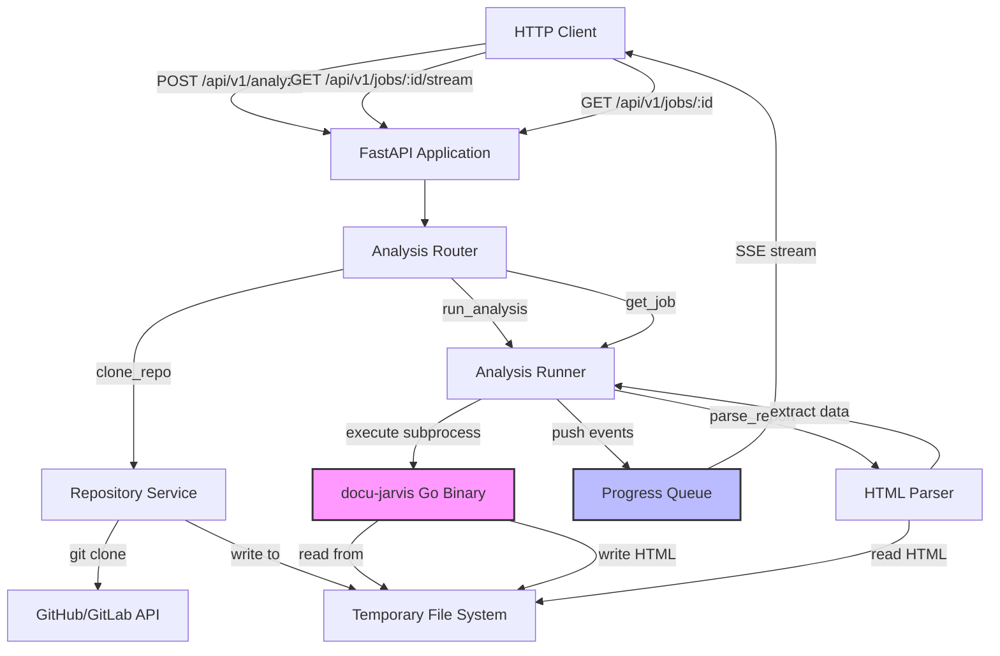

# Data Flow Architecture

## Table of Contents

- [Overview](#overview)
- [Repo Use Cases](#repo-use-cases)
- [High-Level Architecture](#high-level-architecture)
- [Core Components](#core-components)
- [Data Flow](#data-flow)
- [Code Implementation](#code-implementation)
  - [Request Submission Flow](#request-submission-flow)
  - [Repository Cloning Flow](#repository-cloning-flow)
  - [Analysis Execution Flow](#analysis-execution-flow)
  - [HTML Report Parsing Flow](#html-report-parsing-flow)
  - [Real-Time Streaming Flow](#real-time-streaming-flow)
  - [Job Status Polling Flow](#job-status-polling-flow)
  - [GitHub Integration Flow](#github-integration-flow)
- [Integration Points](#integration-points)
- [Configuration](#configuration)
- [Monitoring and Operations](#monitoring-and-operations)

## Overview

The Docu-Jarvis Backend is a FastAPI-based wrapper service that exposes a Go CLI binary (`docu-jarvis`) as a REST and Server-Sent Events (SSE) API. The system accepts code analysis requests for GitHub/GitLab repositories, clones the target repository, executes the analysis using the Go binary, parses the resulting HTML reports, and streams real-time progress to clients.

The data flow architecture is characterised by:

- **Asynchronous job orchestration** with background task execution
- **Multi-stage data transformations** from HTTP requests through subprocess execution to structured JSON responses
- **Real-time event streaming** via SSE for progress updates
- **Stateful in-memory job tracking** with queues for inter-task communication
- **HTML-to-structured-data parsing** for security, impact, and historical analysis reports

## Repo Use Cases

### 1. Submit Code Security Analysis

**Trigger**: Client submits `POST /api/v1/analyze` with `mode: "security"` and a repository URL.

**Code Path**: `app/routers/analysis.py:start_analysis` → `app/services/repo_service.py:clone_repo` → `app/services/runner.py:run_analysis` → `app/services/parser.py:parse_report`

**Output**: Returns immediate `202 Accepted` response with `job_id`. Background task clones repository, executes Go binary with `-security` flag, parses HTML report, extracts security findings (CRITICAL/HIGH/MEDIUM/LOW), and updates job status to `completed` with structured `SecurityResult`.

**Constraints**: Requires valid `docu-jarvis` binary path, GitHub/GitLab URL, and Claude CLI authentication on the server.

### 2. Stream Real-Time Analysis Progress

**Trigger**: Client connects to `GET /api/v1/jobs/{job_id}/stream` after job submission.

**Code Path**: `app/routers/analysis.py:stream_job_progress` → reads from `AnalysisJob.progress_queue` → streams events via SSE.

**Output**: Server-Sent Events stream containing `{"type": "log", "text": "..."}` for each output line from the Go binary, `{"type": "status", "text": "..."}` for status updates, and `{"type": "done", "status": "completed"}` when analysis finishes.

**Constraints**: 30-second timeout for queue reads with keep-alive pings. Stream terminates when `type: "done"` event is sent.

### 3. Poll Job Status and Retrieve Results

**Trigger**: Client periodically sends `GET /api/v1/jobs/{job_id}` to check completion.

**Code Path**: `app/routers/analysis.py:get_job_status` → `app/services/runner.py:get_job` → returns in-memory job state.

**Output**: JSON response with `job_id`, `status` (pending/cloning/running/completed/failed), `mode`, `repo_url`, optional `error`, and optional `result` (parsed report data).

**Constraints**: Jobs are stored in-memory only; server restart loses all job state.

### 4. Push Analysis Report to GitHub Repository

**Trigger**: Client submits `POST /api/v1/jobs/{job_id}/push-to-repo` with GitHub token and markdown content after job completion.

**Code Path**: `app/routers/analysis.py:push_report_to_repo` → uses GitPython to create branch, commit markdown file, push to GitHub, and create PR via GitHub REST API.

**Output**: Returns `pr_url`, `file_path`, and `branch` name. Creates a new branch (`codeflowai-{mode}-{timestamp}`), commits the report to `docs/{mode}-report.md`, and opens a pull request against the default branch.

**Constraints**: Requires completed job, valid GitHub token with push permissions, and cloned repository still present in temporary storage.

### 5. Execute Impact Analysis with Call Graph

**Trigger**: Client submits analysis request with `mode: "impact"` and `target` specifying a function or file path.

**Code Path**: Same as security analysis but executes Go binary with `-impact` flag. Parser extracts risk score (0-100), call graph depth, affected packages, and AI-generated impact narrative sections.

**Output**: Structured `ImpactResult` with risk assessment, testing strategy recommendations, and critical call paths.

**Constraints**: Requires sufficient Git history depth (depth=200 configured in clone operation).

## High-Level Architecture



**Architectural Decisions**:

- **In-memory job storage**: The `_jobs` dictionary in `app/services/runner.py:26` stores all job state. This is evidenced as suitable for single-process deployments but not production-ready for distributed systems.
- **PTY-based subprocess execution**: `app/services/runner.py:146` uses pseudo-terminals to capture real-time output from the Go binary's bubbletea TUI, enabling progress streaming.
- **Asynchronous queue-based event propagation**: Each job maintains an `asyncio.Queue` (`app/services/runner.py:85`) for thread-safe communication between the subprocess executor thread and the SSE event generator coroutine.

## Core Components

### 1. FastAPI Application (`app/main.py`)

**Purpose**: Application entry point and middleware configuration.

**Responsibilities**:
- Initialises FastAPI application with OpenAPI metadata
- Configures CORS middleware for cross-origin requests from frontend
- Registers routers for analysis and health endpoints
- Sets up application lifespan logging

**Key Files**: `app/main.py:25`

### 2. Analysis Router (`app/routers/analysis.py`)

**Purpose**: HTTP endpoint handlers for analysis job lifecycle.

**Responsibilities**:
- Validates incoming analysis requests
- Creates jobs and schedules background execution
- Provides SSE streaming endpoint for real-time progress
- Implements job status polling endpoint
- Handles GitHub PR creation for report submission

**Key Files**: `app/routers/analysis.py`

### 3. Request/Response Models (`app/models/`)

**Purpose**: Pydantic models for request validation and response serialisation.

**Components**:
- `AnalysisRequest` (`app/models/requests.py:40`): Validates repo URLs, mode enum, and optional parameters
- `JobResponse` (`app/models/responses.py:99`): Standardises job status responses
- `SecurityResult`, `ImpactResult`, `WhyResult` (`app/models/responses.py`): Structured report data
- `ProgressEvent` (`app/models/responses.py:108`): SSE event envelope

**Key Files**: `app/models/requests.py`, `app/models/responses.py`

### 4. Repository Service (`app/services/repo_service.py`)

**Purpose**: Git repository cloning and cleanup operations.

**Responsibilities**:
- Clones GitHub/GitLab repositories to job-specific temporary directories
- Injects GitHub tokens into clone URLs for private repository access
- Manages repository cleanup on job deletion

**Key Files**: `app/services/repo_service.py:16`

### 5. Analysis Runner (`app/services/runner.py`)

**Purpose**: Job orchestration and subprocess execution.

**Components**:
- `AnalysisJob` class (`app/services/runner.py:75`): In-memory job state container
- `create_job`, `get_job` functions: Job registry management
- `run_analysis` (`app/services/runner.py:226`): Async wrapper for subprocess execution
- `_run_with_pty` (`app/services/runner.py:146`): PTY-based subprocess executor with real-time output capture

**Responsibilities**:
- Maintains in-memory job registry
- Builds Go binary command arguments based on analysis mode
- Executes analysis in thread pool to avoid blocking event loop
- Streams output lines to progress queue in real time
- Coordinates HTML report parsing on completion

**Key Files**: `app/services/runner.py`

### 6. HTML Parser (`app/services/parser.py`)

**Purpose**: Transforms HTML reports from the Go binary into structured JSON.

**Responsibilities**:
- Parses HTML using BeautifulSoup to extract key-value statistics and narrative sections
- Implements mode-specific parsers for security, impact, and why analyses
- Extracts severity counts, findings, risk scores, and AI-generated recommendations
- Handles HTML structure variations and missing fields gracefully

**Key Files**: `app/services/parser.py:289`

### 7. Configuration Management (`app/core/config.py`)

**Purpose**: Application settings loaded from environment variables.

**Responsibilities**:
- Loads configuration from `.env` file using Pydantic Settings
- Provides paths to Go binary and temporary storage directory
- Configures CORS origins and job timeout

**Key Files**: `app/core/config.py:10`

### 8. Exception Handlers (`app/core/exceptions.py`)

**Purpose**: Custom HTTP exceptions for domain-specific error cases.

**Defined Exceptions**:
- `BinaryNotFoundError` (503): Go binary not found at configured path
- `RepoCloneError` (422): Git clone operation failed
- `JobNotFoundError` (404): Requested job ID does not exist

**Key Files**: `app/core/exceptions.py`

## Data Flow

Data moves through the system in the following stages:

### Stage 1: Request Ingestion and Validation

**Input**: HTTP POST request to `/api/v1/analyze` with JSON body.

**Transformation**: Pydantic `AnalysisRequest` model validates:
- Repository URL format (must start with `https://github.com/`, `https://gitlab.com/`, or `git@`)
- Analysis mode (security, impact, why, debug, explain, update_docs, write_docs)
- Optional parameters specific to the mode (target, commit hash, date ranges)

**Output**: Validated `AnalysisRequest` object.

**Location**: `app/routers/analysis.py:33`, `app/models/requests.py:40`

### Stage 2: Job Creation and Registry

**Input**: Validated request and generated UUID.

**Transformation**: `create_job` function creates `AnalysisJob` instance with:
- Unique job ID
- Initial status (`pending`)
- Empty progress queue
- Reference to repo URL and mode

**Output**: In-memory job object stored in `_jobs` dictionary, keyed by job ID.

**State Change**: Job status transitions from `pending` → `cloning`.

**Location**: `app/services/runner.py:98`

### Stage 3: Repository Cloning

**Input**: Repository URL, job ID, optional GitHub token.

**Transformation**:
- Constructs job-specific temporary directory path (`/tmp/docu-jarvis/{job_id}/repo`)
- Injects GitHub token into URL netloc if provided (`https://{token}@github.com/...`)
- Executes `git clone` with `depth=200` and `single_branch=True` via GitPython

**Output**: Local repository clone at `{temp_dir}/{job_id}/repo`.

**Side Effects**: Emits progress event: `{"type": "status", "text": "Repository cloned. Starting analysis…"}`.

**Error Handling**: On `GitCommandError`, removes partial clone directory and raises `RepoCloneError`.

**Location**: `app/services/repo_service.py:16`, `app/routers/analysis.py:46`

### Stage 4: Command Construction

**Input**: Analysis mode, target path, report output path, mode-specific options.

**Transformation**: `_build_cmd` function builds subprocess command array:
- Security/Impact/Why: `[binary, "-{mode}", target, "-report", report_path]`
- Debug: `[binary, "-debug", from_date, to_date, bug_description]`
- Explain: `[binary, "-explain", commit_hash, question]`
- Update/Write Docs: `[binary, "-{mode}-docs", topics/files]`

**Output**: List of command arguments ready for subprocess execution.

**Location**: `app/services/runner.py:109`

### Stage 5: Subprocess Execution with Real-Time Output Streaming

**Input**: Command array, repository path, environment variables, progress callback.

**Transformation**:
- Opens pseudo-terminal (PTY) to enable TUI rendering from Go binary
- Spawns subprocess with stdin/stdout/stderr connected to PTY slave
- Reads chunks from PTY master in non-blocking loop with `select.select`
- Strips ANSI escape codes and splits on `\r` or `\n`
- Filters bubbletea spinner frames (deduplicates consecutive identical lines)
- Detects Claude spending cap errors and enriches error messages

**Output Stream**: Each clean output line is pushed to `job.progress_queue` as `{"type": "log", "text": line}`.

**State Change**: Job status transitions `cloning` → `running` before execution starts.

**Concurrency Model**: Runs in thread pool executor to avoid blocking asyncio event loop. Uses `loop.call_soon_threadsafe` to push events from worker thread to async queue.

**Location**: `app/services/runner.py:146`, `app/services/runner.py:226`

### Stage 6: HTML Report Parsing

**Input**: HTML file written by Go binary to `{temp_dir}/{job_id}/report.html`.

**Transformation**: Mode-specific parser extracts structured data:

- **Security** (`_parse_security`):
  - Extracts key-value statistics (files scanned, lines scanned, scan duration)
  - Parses severity badge counts (CRITICAL/HIGH/MEDIUM/LOW)
  - Iterates over `.finding` divs to extract title, file path, line number, snippet, and narrative sections
  - Constructs `SecurityFinding` objects with explanation, why dangerous, how to fix

- **Impact** (`_parse_impact`):
  - Extracts risk score from `.risk-bar` badge (e.g., "36/100")
  - Parses call graph metrics (direct callers, total callers, max depth)
  - Extracts AI narrative sections (what changing, direct impact, indirect impact, critical paths, safety net, testing strategy, next steps)

- **Why** (`_parse_why`):
  - Extracts classification, confidence score (e.g., "HIGH (9/10)"), still needed flag
  - Parses narrative sections (what it does, most likely reason, evidence summary, what breaks, next steps)
  - Extracts commit history metadata

**Output**: Structured dictionary conforming to `SecurityResult`, `ImpactResult`, or `WhyResult` schema, including `raw_html` for fallback display.

**Error Handling**: If HTML parsing fails, falls back to raw output lines joined with newlines.

**Location**: `app/services/parser.py:289`, `app/services/runner.py:309`

### Stage 7: Job Completion and Result Storage

**Input**: Parsed report data or raw output.

**Transformation**:
- Assigns parsed data to `job.result`
- Updates `job.status` to `completed` or `failed`
- Pushes final event: `{"type": "done", "status": "completed"}`

**Output**: Job state updated in in-memory registry, accessible via job ID.

**Location**: `app/services/runner.py:310`

### Stage 8: Client Consumption

**Polling Path**: Client calls `GET /api/v1/jobs/{job_id}` to retrieve full job state including result.

**Streaming Path**: Client receives SSE events in real time via `GET /api/v1/jobs/{job_id}/stream` until `type: "done"` event terminates stream.

**Location**: `app/routers/analysis.py:72`, `app/routers/analysis.py:80`

## Code Implementation

### Request Submission Flow

The analysis request flow begins when a client submits a POST request to the `/api/v1/analyze` endpoint.

**File: `app/routers/analysis.py`**
```python
@router.post("/analyze", response_model=JobResponse, status_code=202)
async def start_analysis(body: AnalysisRequest, background_tasks: BackgroundTasks):
    # Validate binary exists
    if not Path(settings.docu_jarvis_binary).exists():
        raise BinaryNotFoundError(settings.docu_jarvis_binary)

    job = create_job(body.mode.value, body.repo_url)
    job.status = JobStatus.cloning
```

**Explanation**: This endpoint handler first validates that the Go binary exists at the configured path. It immediately creates a job entry with a unique ID and sets the initial status to `cloning`. The handler returns a `202 Accepted` response with the job ID, allowing the client to poll or stream progress whilst the background task executes.

**File: `app/models/requests.py`**
```python
class AnalysisRequest(BaseModel):
    repo_url: str
    mode: AnalysisMode
    options: AnalysisOptions = AnalysisOptions()
    api_key: Optional[str] = None
    github_token: Optional[str] = None

    @field_validator("repo_url")
    @classmethod
    def validate_repo_url(cls, v: str) -> str:
        v = v.strip()
        if not v.startswith(("https://github.com/", "https://gitlab.com/", "git@")):
            raise ValueError("Only GitHub / GitLab URLs are supported.")
        return v
```

**Explanation**: Pydantic automatically validates the request body before it reaches the handler. The `validate_repo_url` validator ensures only GitHub and GitLab URLs are accepted, rejecting invalid inputs with a 422 response before any processing occurs.

**File: `app/routers/analysis.py`**
```python
    async def _run():
        try:
            await job.progress_queue.put({"type": "status", "text": "Cloning repository…"})
            # Clone in thread pool to not block the event loop
            loop = asyncio.get_running_loop()
            repo_path = await loop.run_in_executor(
                None, clone_repo, body.repo_url, job.job_id, body.github_token
            )
            await job.progress_queue.put(
                {"type": "status", "text": "Repository cloned. Starting analysis…"}
            )
            opts = body.options.model_dump()
            if body.github_token:
                opts["github_token"] = body.github_token
            await run_analysis(
                job=job,
                repo_path=repo_path,
                target=body.options.target,
                api_key="",
                options=opts,
            )
        except Exception as exc:
            logger.exception("Job %s failed", job.job_id)
            job.status = JobStatus.failed
            job.error = str(exc)
            await job.progress_queue.put({"type": "done", "status": "failed"})

    background_tasks.add_task(_run)
    return job.to_dict()
```

**Explanation**: The `_run` coroutine is scheduled as a background task, allowing the HTTP response to return immediately. It coordinates the entire analysis lifecycle: cloning the repository, executing the analysis, and handling errors. Progress events are pushed to the job's queue at each stage, making them available to any connected SSE streams.

### Repository Cloning Flow

After the job is created, the background task clones the target repository to a temporary directory.

**File: `app/services/repo_service.py`**
```python
def clone_repo(repo_url: str, job_id: str, github_token: str | None = None) -> str:
    """
    Clone *repo_url* into a job-specific temp directory.
    If *github_token* is provided it is embedded in the clone URL so private
    repos owned by the user are accessible.
    Returns the absolute path to the cloned repo.
    """
    dest = Path(settings.temp_dir) / job_id / "repo"
    dest.mkdir(parents=True, exist_ok=True)

    # Inject token into HTTPS URL: https://TOKEN@github.com/...
    clone_url = repo_url
    if github_token:
        from urllib.parse import urlparse, urlunparse
        parsed = urlparse(repo_url)
        if parsed.scheme in ("http", "https"):
            authed = parsed._replace(netloc=f"{github_token}@{parsed.hostname}")
            clone_url = urlunparse(authed)
```

**Explanation**: The cloning service creates a unique directory for each job using the job ID. If a GitHub token is provided, it is injected into the URL's netloc to enable cloning of private repositories. This transformation happens before the clone operation, ensuring authentication is transparent to GitPython.

**File: `app/services/repo_service.py`**
```python
    try:
        logger.info("Cloning %s → %s", repo_url, dest)
        git.Repo.clone_from(
            clone_url,
            str(dest),
            depth=200,  # sufficient for history-based analyses
            single_branch=True,
        )
        return str(dest)
    except git.GitCommandError as exc:
        shutil.rmtree(str(dest.parent), ignore_errors=True)
        raise RepoCloneError(repo_url, str(exc)) from exc
```

**Explanation**: GitPython performs the actual clone operation with a depth limit of 200 commits. This depth is sufficient for the "why" and "debug" modes which analyse Git history. If cloning fails, the partial directory is removed to avoid leaving orphaned files, and a `RepoCloneError` is raised, which sets the job status to `failed` in the background task's exception handler.

### Analysis Execution Flow

Once the repository is cloned, the runner constructs the command for the Go binary and executes it in a subprocess.

**File: `app/services/runner.py`**
```python
def _build_cmd(mode: str, target: str, report_path: str, options: dict) -> list[str]:
    binary = settings.docu_jarvis_binary
    if not Path(binary).exists():
        raise AnalysisError(
            f"docu-jarvis binary not found at '{binary}'. "
            "Set DOCU_JARVIS_BINARY in .env."
        )

    if mode in ("security", "impact", "why"):
        return [binary, f"-{mode}", target, "-report", report_path]

    if mode == "debug":
        from_date = options.get("from_date", "1 month ago")
        to_date = options.get("to_date", "today")
        bug_desc = options.get("bug_description", "unknown bug")
        return [binary, "-debug", from_date, to_date, bug_desc]
```

**Explanation**: Command construction is mode-specific. For security, impact, and why modes, the command includes the target path and report output path. For debug mode, it constructs a command with date ranges and bug description. This function centralises all command-building logic and validates binary existence before execution.

**File: `app/services/runner.py`**
```python
async def run_analysis(
    job: AnalysisJob,
    repo_path: str,
    target: str,
    api_key: str,
    options: dict,
) -> None:
    """
    Async wrapper — runs the Go binary in a thread pool, streams
    progress lines back through job.progress_queue in real time.
    """
    from app.services.parser import parse_report

    loop = asyncio.get_running_loop()

    # Set up report output path
    report_path = str(Path(settings.temp_dir) / job.job_id / "report.html")
    Path(report_path).parent.mkdir(parents=True, exist_ok=True)
    job.report_path = report_path

    # Build env — pass repo URL to the Go binary.
    # DO NOT set ANTHROPIC_API_KEY here: the Go binary calls the claude CLI
    # which uses its own stored auth (~/.claude/).  Overriding with a raw
    # API key breaks the claude CLI and causes exit-code-1 failures.
    env = {**os.environ, "REPO_URL": job.repo_url, "TERM": "xterm-256color"}
    # Expose token so the Go binary can use it for git operations if needed
    if options.get("github_token"):
        env["GITHUB_TOKEN"] = options["github_token"]
```

**Explanation**: The runner sets up the environment for subprocess execution. Critically, it does not override `ANTHROPIC_API_KEY` because the Go binary uses the Claude CLI, which requires its own authentication from `~/.claude/`. The `TERM` variable enables colour and TUI features from the bubbletea library. The repository URL is passed as an environment variable for the binary to use in reports.

**File: `app/services/runner.py`**
```python
    job.status = JobStatus.running
    await job.progress_queue.put(
        {"type": "status", "text": f"Running {job.mode} analysis…"}
    )

    def _send(line: str) -> None:
        """Thread-safe real-time progress push from worker thread."""
        loop.call_soon_threadsafe(
            job.progress_queue.put_nowait, {"type": "log", "text": line}
        )

    # Capture lines via closure so they're available after the executor finishes
    output_lines: list[str] = []

    def _run() -> int:
        def on_line(line: str) -> None:
            output_lines.append(line)
            _send(line)  # stream each line to the client as it arrives

        return _run_with_pty(cmd, repo_path, env, on_line)
```

**Explanation**: The `_send` closure uses `call_soon_threadsafe` to push log events from the worker thread to the async queue. This is necessary because the subprocess executor runs in a thread pool (to avoid blocking the event loop), but the progress queue is an asyncio queue that can only be safely modified from the event loop thread. The `on_line` callback is invoked for every line of output from the subprocess.

**File: `app/services/runner.py`**
```python
    try:
        rc = await asyncio.wait_for(
            loop.run_in_executor(None, _run),
            timeout=settings.job_timeout,
        )
    except asyncio.TimeoutError:
        job.status = JobStatus.failed
        job.error = "Analysis timed out"
        await job.progress_queue.put({"type": "done", "status": "failed"})
        return
    except Exception as exc:
        logger.exception("Unexpected error during analysis")
        job.status = JobStatus.failed
        job.error = str(exc)
        await job.progress_queue.put({"type": "done", "status": "failed"})
        return

    # Yield to the event loop so all call_soon_threadsafe-scheduled put_nowait
    # callbacks from _send() are processed BEFORE we enqueue the "done" event.
    await asyncio.sleep(0)
```

**Explanation**: The executor is wrapped with a timeout (default 600 seconds from configuration). The `await asyncio.sleep(0)` after execution is critical: it yields control to the event loop, ensuring all `call_soon_threadsafe` callbacks from `_send()` are processed before the final "done" event is pushed. Without this, the done event might arrive before the last log lines, breaking the stream ordering.

### HTML Report Parsing Flow

After the subprocess completes successfully, the HTML report is parsed into structured data.

**File: `app/services/runner.py`**
```python
    # Parse HTML report (security / impact / why) or use raw output
    html_path = Path(report_path)
    if html_path.exists():
        try:
            result = parse_report(html_path.read_text(encoding="utf-8"), job.mode)
            job.result = result
            job.status = JobStatus.completed
        except Exception as exc:
            logger.warning("HTML parse failed, falling back to raw output: %s", exc)
            job.result = {"output": "\n".join(output_lines)}
            job.status = JobStatus.completed
    elif output_lines:
        # debug / explain — no HTML report
        job.result = {"output": "\n".join(output_lines)}
        job.status = JobStatus.completed
    else:
        job.status = JobStatus.failed
        job.error = f"Analysis produced no output (exit code {rc})"

    await job.progress_queue.put({"type": "done", "status": job.status.value})
```

**Explanation**: The runner checks if an HTML report was generated. If it exists, it calls the parser. If parsing fails (e.g., unexpected HTML structure), it falls back to raw output rather than failing the entire job. For modes like debug and explain that do not produce HTML reports, the raw output lines are returned directly. The final "done" event signals to SSE clients that the stream is complete.

**File: `app/services/parser.py`**
```python
def parse_report(html_content: str, mode: str) -> dict[str, Any]:
    soup = BeautifulSoup(html_content, "html.parser")

    if mode == "security":
        return _parse_security(soup, html_content)
    if mode == "impact":
        return _parse_impact(soup, html_content)
    if mode == "why":
        return _parse_why(soup, html_content)

    # fallback — return raw HTML for the frontend to embed
    return {"raw_html": html_content}
```

**Explanation**: The parser delegates to mode-specific functions based on the analysis type. Each parser is tailored to the HTML structure produced by the Go binary's report templates. The raw HTML is always included in the result so the frontend can render it directly if needed.

**File: `app/services/parser.py`**
```python
def _parse_security(soup: BeautifulSoup, raw_html: str) -> dict[str, Any]:
    kv = _kv_map(soup)

    # ── Severity counts ───────────────────────────────────────────────────────
    # Counts live in summary badge spans like <span class="badge sev-high">HIGH 6</span>
    # which are OUTSIDE .finding divs. Finding badges have no number.
    critical = high = medium = low = 0
    for badge in soup.select(".badge"):
        # Skip badges that are inside a .finding element
        if badge.find_parent(class_="finding"):
            continue
        text = _text(badge)
        m = re.match(r"^(CRITICAL|HIGH|MEDIUM|LOW)\s+(\d+)$", text, re.IGNORECASE)
        if m:
            sev, cnt = m.group(1).upper(), int(m.group(2))
            if sev == "CRITICAL":
                critical = cnt
            elif sev == "HIGH":
                high = cnt
            elif sev == "MEDIUM":
                medium = cnt
            elif sev == "LOW":
                low = cnt
```

**Explanation**: The security parser extracts severity counts from badge elements in the HTML summary. It distinguishes between summary badges (which contain counts like "HIGH 6") and per-finding badges (which only show the severity level) by checking if the badge is inside a `.finding` div. This separation is necessary because the HTML template uses the same CSS class for both purposes.

**File: `app/services/parser.py`**
```python
    # ── Findings ──────────────────────────────────────────────────────────────
    findings_data: list[dict] = []
    for idx, f_el in enumerate(soup.select(".finding")):
        # Severity from badge inside .title
        badge_el = f_el.select_one(".badge")
        severity = _text(badge_el).upper() if badge_el else "LOW"

        # File, line, category, detected_by from .meta div
        meta_el = f_el.select_one(".meta")
        file_path, line_num, category, detected_by = _parse_meta(_text(meta_el) if meta_el else "")

        # AI narrative sections inside the finding
        sections: dict[str, str] = {}
        for sec in f_el.select(".section"):
            h = sec.select_one("h3")
            b = sec.select_one(".body")
            if h and b:
                sections[_text(h).lower()] = _text(b)

        findings_data.append(
            {
                "id": f"finding-{idx}",
                "rule_id": category or f"finding-{idx}",
                "category": category,
                "severity": severity,
                "title": title,
                "file": file_path,
                "line": line_num,
                "snippet": snippet,
                "description": sections.get("description", ""),
                "explanation": sections.get("explanation", ""),
                "why_dangerous": sections.get("why dangerous", sections.get("why dangerous", "")),
                "how_to_fix": sections.get("how to fix", sections.get("how to fix", "")),
                "detected_by": detected_by or "pattern",
            }
        )
```

**Explanation**: Each `.finding` div is transformed into a structured finding object. The parser extracts metadata from the `.meta` line (file path, line number, category, detection method), the code snippet from `<pre>` or `<code>` elements, and AI-generated narrative sections (description, explanation, why dangerous, how to fix). This structure matches the `SecurityFinding` Pydantic model defined in responses.

### Real-Time Streaming Flow

Clients can subscribe to real-time progress updates via the SSE endpoint.

**File: `app/routers/analysis.py`**
```python
@router.get("/jobs/{job_id}/stream")
async def stream_job_progress(job_id: str):
    """Server-Sent Events stream for real-time analysis progress."""
    job = get_job(job_id)
    if job is None:
        raise JobNotFoundError(job_id)

    async def _event_generator():
        while True:
            try:
                event = await asyncio.wait_for(job.progress_queue.get(), timeout=30)
            except asyncio.TimeoutError:
                # Keep-alive ping
                yield "event: ping\ndata: {}\n\n"
                continue

            data = json.dumps(event)
            yield f"data: {data}\n\n"

            if event.get("type") == "done":
                break

    return StreamingResponse(
        _event_generator(),
        media_type="text/event-stream",
        headers={
            "Cache-Control": "no-cache",
            "X-Accel-Buffering": "no",
            "Connection": "keep-alive",
        },
    )
```

**Explanation**: The SSE endpoint creates a streaming response that reads from the job's progress queue. It uses a 30-second timeout with keep-alive pings to prevent connection closure during periods of low activity. The generator terminates when it encounters a "done" event, signalling completion. The headers disable caching and buffering to ensure events arrive in real time.

### Job Status Polling Flow

Clients that do not use SSE can poll the job status endpoint.

**File: `app/routers/analysis.py`**
```python
@router.get("/jobs/{job_id}", response_model=JobResponse)
async def get_job_status(job_id: str):
    job = get_job(job_id)
    if job is None:
        raise JobNotFoundError(job_id)
    return job.to_dict()
```

**Explanation**: The polling endpoint retrieves the job from the in-memory registry and returns its current state. The `to_dict()` method serialises the job to match the `JobResponse` schema, including status, error message, and parsed result data.

**File: `app/services/runner.py`**
```python
class AnalysisJob:
    def __init__(self, job_id: str, mode: str, repo_url: str):
        self.job_id = job_id
        self.mode = mode
        self.repo_url = repo_url
        self.status: JobStatus = JobStatus.pending
        self.error: Optional[str] = None
        self.result: Optional[dict] = None
        self.report_path: Optional[str] = None
        # Unlimited queue — progress events are small
        self.progress_queue: asyncio.Queue = asyncio.Queue()

    def to_dict(self) -> dict:
        return {
            "job_id": self.job_id,
            "status": self.status,
            "mode": self.mode,
            "repo_url": self.repo_url,
            "error": self.error,
            "result": self.result,
        }
```

**Explanation**: The `AnalysisJob` class holds all mutable state for a job. The progress queue has no size limit because progress events are small JSON objects. The `to_dict` method provides the serialisation used by both the polling and SSE endpoints.

### GitHub Integration Flow

After analysis completion, clients can push the results to GitHub as a pull request.

**File: `app/routers/analysis.py`**
```python
@router.post("/jobs/{job_id}/push-to-repo")
async def push_report_to_repo(job_id: str, body: PushReportBody):
    """Convert analysis report to markdown, push branch, and open a PR."""
    job = get_job(job_id)
    if job is None:
        raise JobNotFoundError(job_id)
    if job.status != "completed":
        raise HTTPException(status_code=400, detail="Job is not completed yet")

    repo_path = Path(settings.temp_dir) / job_id / "repo"
    if not repo_path.exists():
        raise HTTPException(
            status_code=410,
            detail="Cloned repository is no longer available — please re-run the analysis first",
        )
```

**Explanation**: The GitHub integration endpoint validates that the job is completed and the cloned repository still exists in temporary storage. If the repository has been cleaned up (via the DELETE endpoint), it returns a 410 Gone status.

**File: `app/routers/analysis.py`**
```python
    # Parse owner/repo from GitHub URL
    match = re.match(r"https://github\.com/([^/]+)/([^/]+?)(?:\.git)?/?$", job.repo_url)
    if not match:
        raise HTTPException(status_code=400, detail="Cannot parse GitHub repository URL")
    owner, repo_name = match.group(1), match.group(2)

    file_path = _MODE_TO_FILE.get(job.mode, f"docs/{job.mode}-report.md")

    gh_headers = {
        "Authorization": f"token {body.github_token}",
        "Accept": "application/vnd.github.v3+json",
    }

    # Get default branch
    async with httpx.AsyncClient(timeout=20) as client:
        info_resp = await client.get(
            f"https://api.github.com/repos/{owner}/{repo_name}",
            headers=gh_headers,
        )
    default_branch = (
        info_resp.json().get("default_branch", "main") if info_resp.is_success else "main"
    )

    branch_name = f"codeflowai-{job.mode}-{datetime.now().strftime('%Y%m%d-%H%M')}"
```

**Explanation**: The endpoint extracts the owner and repository name from the original repository URL using a regex pattern. It queries the GitHub API to determine the default branch (main, master, etc.) so the PR is opened against the correct base. The branch name includes a timestamp to avoid conflicts with previous reports.

**File: `app/routers/analysis.py`**
```python
    # Git operations
    try:
        git_repo = _git.Repo(str(repo_path))
        git_repo.git.checkout(default_branch)
        git_repo.git.checkout("-b", branch_name)

        full_path = repo_path / file_path
        full_path.parent.mkdir(parents=True, exist_ok=True)
        full_path.write_text(body.markdown_content, encoding="utf-8")

        git_repo.git.add(file_path)
        git_repo.git.config("user.email", "codeflowai@bot.local")
        git_repo.git.config("user.name", "CodeFlowAI")
        git_repo.git.commit("-m", f"docs: add {job.mode} analysis report by CodeFlowAI")

        auth_remote = f"https://{body.github_token}@github.com/{owner}/{repo_name}.git"
        git_repo.git.push(auth_remote, branch_name)
    except _git.GitCommandError as exc:
        raise HTTPException(status_code=500, detail=f"Git error: {exc.stderr.strip()[:300]}")
```

**Explanation**: GitPython performs the Git operations: checkout default branch, create new branch, write markdown file, commit, and push. The GitHub token is injected into the push URL for authentication. The commit author is set to a bot identity to distinguish automated commits from user commits.

**File: `app/routers/analysis.py`**
```python
    # Create PR
    async with httpx.AsyncClient(timeout=30) as client:
        pr_resp = await client.post(
            f"https://api.github.com/repos/{owner}/{repo_name}/pulls",
            headers=gh_headers,
            json={
                "title": f"[CodeFlowAI] {job.mode.replace('_', ' ').title()} Report",
                "body": (
                    f"Automated analysis report generated by **CodeFlowAI**.\n\n"
                    f"**Mode:** `{job.mode}`  \n"
                    f"**Repository:** {job.repo_url}  \n"
                    f"**Generated:** {datetime.now().strftime('%Y-%m-%d %H:%M UTC')}\n\n"
                    f"---\n*Report saved at `{file_path}`*"
                ),
                "head": branch_name,
                "base": default_branch,
            },
        )

    if pr_resp.status_code not in (200, 201):
        raise HTTPException(
            status_code=500,
            detail=f"Failed to create PR: {pr_resp.json().get('message', 'Unknown error')[:200]}",
        )

    return {
        "pr_url": pr_resp.json()["html_url"],
        "file_path": file_path,
        "branch": branch_name,
    }
```

**Explanation**: The GitHub REST API creates the pull request with a descriptive title and body. The response includes the PR URL for the client to display. If PR creation fails (e.g., due to insufficient permissions), the error message from GitHub is returned to help diagnose the issue.

## Integration Points

### 1. docu-jarvis Go Binary

**Integration Type**: Local subprocess execution via PTY.

**Usage**: The Go binary is the core analysis engine. It is invoked as a subprocess with mode-specific flags and writes HTML reports to the filesystem.

**Evidence**: Command construction in `app/services/runner.py:109`, subprocess execution in `app/services/runner.py:146`.

**Communication**: Reads from stdin/stdout/stderr via PTY. Receives repository path as CWD, repository URL via `REPO_URL` environment variable, and GitHub token via `GITHUB_TOKEN` environment variable.

**Dependency Configuration**: Binary path configured via `DOCU_JARVIS_BINARY` environment variable (default: `../FYP-AI/docu-jarvis`).

### 2. Claude CLI

**Integration Type**: Indirectly via Go binary.

**Usage**: The Go binary invokes the Claude CLI for AI-powered analysis. The CLI must be authenticated separately using `~/.claude/` credentials.

**Evidence**: Comment in `app/services/runner.py:247` explicitly states: "DO NOT set ANTHROPIC_API_KEY here: the Go binary calls the claude CLI which uses its own stored auth (~/.claude/)."

**Authentication**: Not managed by this service. Operators must authenticate the Claude CLI separately before starting the backend.

### 3. GitHub/GitLab Git Hosting

**Integration Type**: Git protocol for repository cloning, HTTPS REST API for PR creation.

**Usage**:
- Cloning: GitPython clones repositories via HTTPS or SSH URLs.
- PR Creation: httpx sends POST requests to GitHub REST API at `https://api.github.com/repos/{owner}/{repo}/pulls`.

**Evidence**:
- Cloning in `app/services/repo_service.py:36`
- PR creation in `app/routers/analysis.py:194`

**Authentication**:
- Cloning: Optional GitHub token injected into URL netloc.
- PR creation: Bearer token authentication via `Authorization` header.

### 4. GitPython Library

**Integration Type**: Python library for Git operations.

**Usage**: Repository cloning (`app/services/repo_service.py:36`) and local Git operations for PR creation (`app/routers/analysis.py:174`).

**Evidence**: Import statements in `app/services/repo_service.py:8` and `app/routers/analysis.py:10`.

### 5. BeautifulSoup (HTML Parser)

**Integration Type**: Python library for HTML parsing.

**Usage**: Parses HTML reports generated by the Go binary into structured JSON data.

**Evidence**: `app/services/parser.py:17`, parsing functions throughout `app/services/parser.py`.

### 6. Temporary File System

**Integration Type**: Local filesystem access.

**Usage**:
- Stores cloned repositories at `{temp_dir}/{job_id}/repo`
- Stores HTML reports at `{temp_dir}/{job_id}/report.html`

**Evidence**: Path construction in `app/services/repo_service.py:23`, `app/services/runner.py:242`.

**Cleanup**: Jobs can be deleted via `DELETE /api/v1/jobs/{job_id}`, which removes the entire job directory using `shutil.rmtree` in `app/services/repo_service.py:52`.

**Configuration**: Temporary directory path configured via `TEMP_DIR` environment variable (default: `/tmp/docu-jarvis`).

## Configuration

Configuration is managed via environment variables loaded from a `.env` file using Pydantic Settings.

**File: `app/core/config.py`**

| Variable | Type | Default | Description |
|----------|------|---------|-------------|
| `ANTHROPIC_API_KEY` | string | `""` | Not used by the backend. Included for potential future direct API usage. The Go binary uses Claude CLI authentication instead. |
| `DOCU_JARVIS_BINARY` | string | `../FYP-AI/docu-jarvis` | Absolute path to the compiled Go binary. Validated on each analysis request. |
| `TEMP_DIR` | string | `/tmp/docu-jarvis` | Directory for cloned repositories and HTML reports. Created automatically on startup. |
| `CORS_ORIGINS` | list[string] | `["http://localhost:3000", "http://127.0.0.1:3000"]` | Allowed origins for CORS. Used by frontend during local development. |
| `JOB_TIMEOUT` | integer | `600` | Maximum execution time in seconds for analysis jobs. Jobs exceeding this timeout are marked as failed. |

**Evidence**: Configuration class defined in `app/core/config.py:10`, settings instance created at `app/core/config.py:37`, temporary directory creation at `app/core/config.py:40`.

**Environment-Specific Configuration**: Not directly evident in the codebase. The same configuration applies to all environments. For production deployments, operators would need to override environment variables via deployment manifests or environment files.

**Configuration Loading**: Pydantic Settings loads from `.env` file in the application root. The `extra="ignore"` setting in `app/core/config.py:14` silently ignores unrecognised environment variables.

## Monitoring and Operations

### Logging

**Evidence**: Basic Python logging configured in `app/main.py:13`:

```python
logging.basicConfig(level=logging.INFO, format="%(levelname)s  %(name)s  %(message)s")
```

**Log Events**:
- Application startup/shutdown: `app/main.py:18`
- Repository cloning: `app/services/repo_service.py:36`
- Job cleanup: `app/services/repo_service.py:54`
- Background task failures: `app/routers/analysis.py:63`
- HTML parsing failures: `app/services/runner.py:313`

**Log Levels**: INFO for operational events, WARNING for recoverable errors, EXCEPTION for job failures.

### Health Check Endpoint

**Evidence**: Health endpoint defined in `app/routers/health.py:10`:

```python
@router.get("/health")
async def health():
    binary_ok = Path(settings.docu_jarvis_binary).exists()
    return {
        "status": "ok",
        "binary_found": binary_ok,
        "binary_path": settings.docu_jarvis_binary,
    }
```

**Purpose**: Verifies that the Go binary exists at the configured path. Does not verify that the binary is executable or that the Claude CLI is authenticated.

### Failure Modes

**Repository Clone Failure**:
- **Cause**: Invalid URL, network error, authentication failure, or insufficient disk space.
- **Detection**: `git.GitCommandError` raised in `app/services/repo_service.py:44`.
- **Handling**: Job marked as failed, partial clone directory removed, `RepoCloneError` exception raised.
- **Evidence**: `app/services/repo_service.py:45`, `app/routers/analysis.py:62`.

**Analysis Timeout**:
- **Cause**: Analysis exceeds configured timeout (default 600 seconds).
- **Detection**: `asyncio.TimeoutError` raised in `app/services/runner.py:289`.
- **Handling**: Job marked as failed with error "Analysis timed out".
- **Evidence**: `app/services/runner.py:290`.

**HTML Parsing Failure**:
- **Cause**: Unexpected HTML structure from Go binary.
- **Detection**: Exception in `parse_report` function.
- **Handling**: Falls back to raw output instead of failing the entire job.
- **Evidence**: `app/services/runner.py:313`.

**Claude CLI Authentication Failure**:
- **Cause**: Claude CLI not authenticated or spending cap reached.
- **Detection**: Pattern matching on subprocess output for "spending cap" or "exit code 1" errors.
- **Handling**: Enhanced error message pushed to progress queue.
- **Evidence**: Spinner filter in `app/services/runner.py:46`.

### Operational Notes

**Job State Persistence**: Jobs are stored in-memory only in the `_jobs` dictionary (`app/services/runner.py:26`). Server restarts lose all job state. For production use, this would need to be replaced with Redis or a database.

**Temporary File Cleanup**: Jobs must be manually cleaned up via `DELETE /api/v1/jobs/{job_id}`. There is no automatic cleanup based on age or completion status. Operators should implement scheduled cleanup to prevent disk exhaustion.

**Concurrency**: FastAPI uses an asyncio event loop with background tasks. Repository cloning and subprocess execution run in thread pool executors to avoid blocking the event loop. The system can handle multiple concurrent analysis jobs limited only by available threads and system resources.

**Binary Dependency**: The service has a hard dependency on the `docu-jarvis` Go binary. If the binary is unavailable, all analysis requests fail with a 503 error. The health endpoint can be used to detect this condition.

**Claude CLI Dependency**: The Go binary depends on the Claude CLI being authenticated. There is no automated check for CLI authentication status. Failed authentication manifests as exit code 1 errors during analysis, which are detected and surfaced via the spinner filter.
